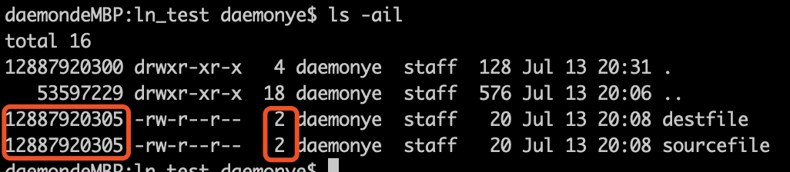

## 前言：
在linux的世界里，大部分情况下，文件名和inode是一对一的关系，文件一旦被删除，文件相关的inode信息就会被抹掉，文件占用的磁盘空间也会被释放。删了，就没了。

**硬链接**和**软链接**技术，让linux世界里的文件和目录具备了副本和替身的能力。

## 硬链接
基于inode技术，linux允许多个文件名同时指向一个inode，好处就是，我们可以用不同的文件名去访问同一个文件，每次操作对文件内容的影响会波及到所有「副本」，删除掉一个「副本」，不会影响其他文件。
增加一个硬链接文件，仅仅是inode里的「Links」属性值加一，
删除一个硬链接文件，「Links」属性值减一。
只有「Links」属性值为0时，文件才会被彻底删除，回收其占用的空间。

### 语法：
```
ln sourcefile destfile
```
创建完成后，用ls -i查看文件，就会发现两个文件的inode号是相同的。


如果使用vim在同一个缓冲区（buffer）中打开这两个文件：
vim sourcefile
:new sourcefile
在操作其中一个文件时，会发现另一个窗口是同步联动的。

### 应用：
* 多人修改同一个文件
* 重要文件备份
* 文件更新
* 节省磁盘空间
* 等。

#### 注意：
1. 无法为目录创建硬链接，但是操作系统在每个目录下创建了两个硬链接，一个是「.」，另一个是「..」，使用ls -ai可以看到这两个硬链接目录和inode号，前者代表了当前目录，后者代表了当前目录的父级目录。
2. 硬链接不创建inode，所以无法跨文件系统，这一点可以由软链接实现。

## 软链接
软链接，类似于Windows系统中的快捷方式。
软链接会创建新的inode，inode里主要记录了源文件的路径，当访问软链接文件时，系统会帮你自动指向源文件，无论你操作的是源文件，还是软链接文件，其实你最终操作的都是源文件。
源文件删除了，软链接文件就成了无本之木，也就毫无意义，强制访问的后果就是「No such file or directory」。

### 语法：
```
ln -s sourcefile destfile
```
软链接可以创建目录的软链接，也能跨文件系统存在，在linux系统中被大量使用。一旦源文件/目录不存在了，软链接的使命也就完结了。